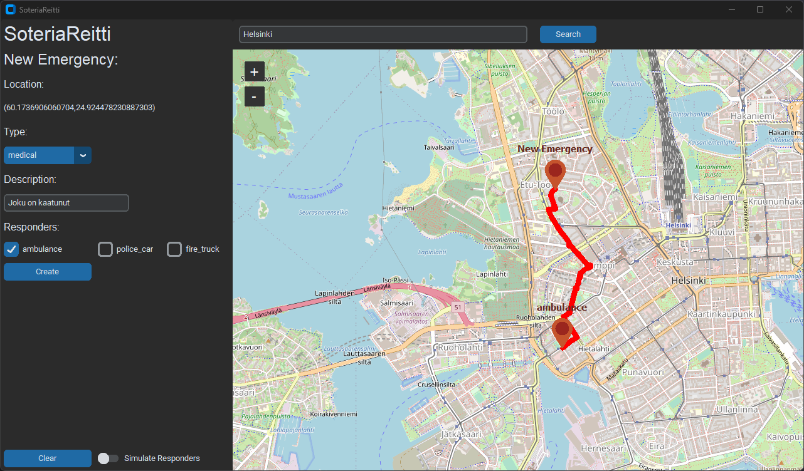

# 

SoteriaReitti on Pythonilla toteutettava sovellus, joka on suunniteltu hätätyöntekijöille. Sovellus auttaa heitä löytämään parhaat mahdolliset reitit hätätilanteissa ja ruuhkaisilla teillä. SoteriaReitti tulee kreikasta ja tarkoittaa pelastuksen tietä, mikä kuvastaa projektin ydintavoitetta: tarjota pelastava reitti niille, jotka sitä tarvitsevat.

Projekti toteutettiin [Tiralabra](https://tiralabra.github.io/2021_p1/index) kurssille Helsingin yliopistossa.

Uusin release: [v0.1.0-beta](https://github.com/3nd3r1/soteriareitti/releases/tag/v0.1.0-beta)

## Screenshot

## Dokumentaatio

-   [Käyttöohje](./docs/kayttoohje.md)
-   [Määrittelydokumentti](./docs/maarittelydokumentti.md)
-   [Toteutusdokumentti](./docs/toteutusdokumentti.md)
-   [Testausdokumentti](./docs/testausdokumentti.md)

### Viikkoraportit

-   [Viikkoraportti #1](./docs/viikkoraportti_1.md)
-   [Viikkoraportti #2](./docs/viikkoraportti_2.md)
-   [Viikkoraportti #3](./docs/viikkoraportti_3.md)
-   [Viikkoraportti #4](./docs/viikkoraportti_4.md)
-   [Viikkoraportti #5](./docs/viikkoraportti_5.md)
-   [Viikkoraportti #6](./docs/viikkoraportti_6.md)
