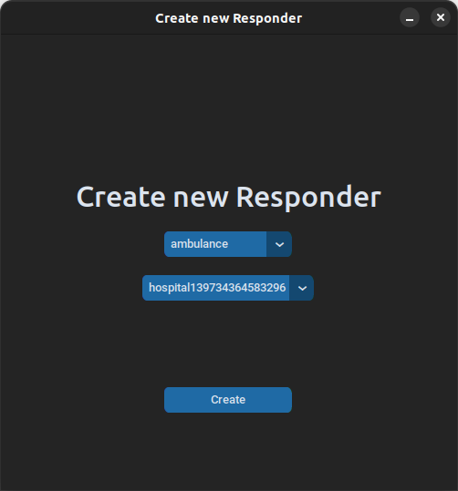
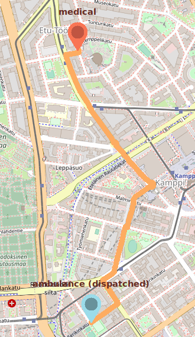

# SoteriaReitti - Sovelluksen Käyttäminen

SoteriaReitti-sovelluksen käyttäminen on suoraviivaista ja intuitiivista. Seuraavassa on vaiheittainen ohje sovelluksen käyttöön:

## Sovelluksen Konfigurointi

Sovellusta voi konfiguroida .env-tiedoston avulla. Tämä tiedosto mahdollistaa erilaisten asetusten määrittämisen, jolloin voit räätälöidä sovelluksen toimintaa tarpeidesi mukaan. Tässä muutamia keskeisiä asetuksia:

_APP_PLACE_: Tämä asetus määrittää paikan, jonka perusteella sovellus toimii. Voit muuttaa tätä arvoa vaihtamalla paikan nimen tai koordinaatit. Esimerkiksi voit asettaa sen "Töölö, Helsinki" tai muihin koordinaatteihin, jotka vastaavat aluetta, jolla haluat testata sovellusta.

_CACHING_: Tämä asetus määrittää, tallennetaanko verkkotiedot kovamuistiin vai ei. Jos tämä asetus on `True`, sovellus tallentaa verkon (graph) kovamuistiin, mikä parantaa suorituskykyä toistuvissa käynnistyksissä. Jos asetus on `False`, verkkoa ei tallenneta kovamuistiin, ja se lasketaan uudelleen joka kerta, kun sovellus käynnistetään.

Esimerkki .env tiedosto:

```
APP_PLACE=Töölö
CACHING=True
```

Muista, että .env-tiedosto on herkkä tiedosto, ja siinä ei tulisi olla ylimääräisiä välilyöntejä tai kommentteja. Varmista, että asetusnimet ovat oikein kirjoitettuja ja niiden arvot vastaavat haluamiasi asetuksia. Sovellus lukee nämä asetukset automaattisesti käynnistyessään, joten kun .env-tiedostoa muutetaan, sovellus ottaa nämä muutokset huomioon seuraavalla käynnistyskerralla.

## Sovelluksen Käynnistäminen:

Lataa ensin projektin uusin release [täältä](https://github.com/3nd3r1/soteriareitti/releases).

### Käynnistäminen lähdekoodista
1. Navigoi juuri-hakemistoon komennolla 

    `cd soteriareitti`

2. Ennen kuin aloitat, varmista, että olet asentanut sovelluksen riippuvuudet komennolla 

    `poetry install`.

3. Käynnistä sovellus komennolla 

    `poetry run invoke start`.

### Käynnistäminen zip-tiedostosta (Vain Windows)

1. Kun lataus on vlamis, pura ladattu zip-tiedosto koneellesi.
2. Käynnistä SoteriaReitti suorittamalla tiedosto *SoteriaReitti.exe*


## Vastausyksiköt ja Asemat

Vastausyksiköt eli **Responderit** ovat liikkuvia hätätilanteisiin vastaavia yksiköitä, kuten ambulansseja ja poliisiautoja, jotka voivat reagoida nopeasti ja liikkua paikasta toiseen tarvittaessa.

Asemat eli **Stationit** ovat paikallaan pysyviä hätätilanteiden vastaajia, kuten sairaaloita ja poliisiasemia, jotka eivät liiku vaan pysyvät tietyissä ennalta määrätyissä paikoissa. Tämä staattinen sijoittuminen tekee niistä tärkeitä tukipisteitä hätätilanteiden hallinnassa ja avunsaannissa.

### Miten lisätä vastausyksikkö tai asema:

1.  Lisää vastausyksikkö tai asema kartalle klikkaamalla haluttua sijaintia hiiren **oikealla** painikkeella. Valitse avautuvasta valikosta "Create Responder" tai "Create Station".
    

-   Avautuvassa ikkunassa valitse vastausyksikön tai aseman tyyppi, ja vahvista valinta. Responderi tai station ilmestyy kartalle kyseiseen sijaintiin.
    

## Hätätilanteet

Hätätilanne eli **Emergency** kuvaa aktiivista hätätilannetta tietyssä sijainnissa kartalla. Hätätilanne voi olla esimerkiksi kolari tai rikosilmoitus. Kun käyttäjä luo hätätilanteen, sovellus pyrkii etsimään lähimmät vastausyksiköt, jotka voivat navigoida hätätilanteen sijaintiin. Mikäli lähellä olevia yksiköitä ei ole saatavilla, hätätilannetta ei voida käsitellä asianmukaisesti.

### Miten luoda hätätilanne:

1. Valitse hätätilanteen sijainti kartalta klikkaamalla hiiren **vasemmalla** painikkeella haluamaasi sijaintia kartalla. Hätätilanteen sijainnin tulee olla alueella, joka on määritetty .env-tiedostossa.


2. Syötä hätätilanteen tiedot sovelluksen vasemmalla olevaan valikkoon. Tässä vaiheessa voit määrittää, mitä vastausyksiköitä hätätilanteeseen tarvitaan ja lisätä muita olennaisia tietoja.


3. Luo hätätilanne klikkaamalla 'Create'. Sovellus näyttää nyt reitin lähimmistä vastausyksiköistä hätätilanteen sijaintiin.



Näiden ohjeiden avulla voit hyödyntää SoteriaReitti-sovelluksen tarjoamia reittisuunnittelutoimintoja hätätilanteiden hallinnassa!

## Simulointi

Vastausyksiköiden liikettä kartalla voidaan simuloida sovelluksessa. Kun simulointi on käynnistetty, vastausyksiköt alkavat liikkua satunnaisiin sijainteihin kartalla. Jos heidät määrätään vastaamaan hätätilanteeseen, vastausyksiköt alkavat liikkua kohti hätätilanteen sijaintia. Tämä simulointi on tarkoitettu antamaan käyttäjälle käsityksen siitä, miten sovellus toimisi oikeassa tilanteessa.

### Miten käynnistää simulointi

Voit aloittaa simuloinnin napsauttamalla "Simulate Responders" -painiketta sovelluksen vasemmassa valikossa.


## Tunnettut Virheet

-   Vastausyksikön ja hätätilanteen luominen voi kestää jonkin aikaa. Tämä johtuu siitä, että vastausyksiköt käyttävät hitaampaa IDA\*-reititysalgoritmia, mikä voi kestää hetken. Tämän ei kuitenkaan pitäisi yleensä viedä yli minuuttia aikaa. Jos loading-näkymä on ollut näkyvillä yli 3 minuuttia, on todennäköistä, että ohjelmassa on tapahtunut virhe.
