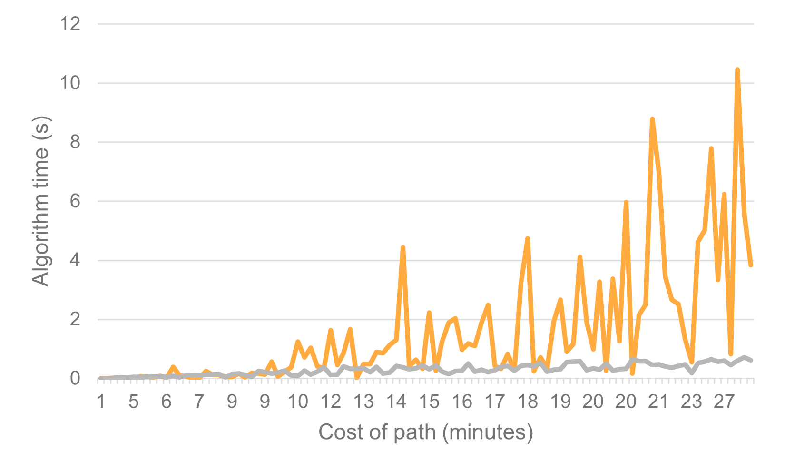

# Testausdokumentti

Ohjelmaa on testattu perusteellisesti automatisoiduilla suorituskyky- ja yksikkötesteillä sekä manuaalisilla järjestelmä- ja käyttöliittymätesteillä. Tämä on varmistanut SoteriaReitti-sovelluksen vakaan ja virheettömän toiminnan erilaisissa tilanteissa ja käyttöympäristöissä.

Päivitetty 24.10.2023

## Yksikkötestit

(Badgea voi klikata.)

Yksikkötestauksen kattavuusraportissa on testattu SoteriaReitti-sovelluksen yksittäisiä komponentteja kuten _Emergency_ ja _Responders_ . Testit kattavat kaikki keskeiset toiminnot, kuten hätätilanteiden reitityksen, stationeiden ja responderien hallinnan sekä yksittäisten tietorakenteiden toimivuuden.

Testit tehtiin hyödyntäen Pythonin unittest-kirjastoa, joka mahdollisti automatisoitujen testien kirjoittamisen jokaiselle komponentille. Jokainen komponentti testattiin erikseen varmistaen, että jokainen osa-alue toimii oikein ja odotetulla tavalla.

Yksikkötestit voidaan suorittaa seuraavasti:

1. Navigoi projektin juureen.
2. Lataa projektin riippuvuudet komennolla:
   `poetry install`
3. Suorita testit komennolla:
   `poetry run invoke test`

### Map
_Map_-luokan toiminnallisuutta on testattu _TestMap_-luokan avulla, joka sisältää useita testejä. Näissä testeissä tarkastellaan muun muassa verkon luontia ja verkon lataamista välimuistista.

### Emergency
_Emergency_-luokan toiminnallisuutta on testattu perusteellisesti käyttäen _TestEmergency_-luokkaa. Nämä testit kattavat hätätilanteiden hallinnan, reittien laskennan ja oikean responderin valinnan. Testit varmistavat, että hätätilanteiden reititys ja lähimmän responderin valinta toimivat oikein.

### Station
_Station_-luokan (kuten sairaalat ja paloasemat) toimintaa on testattu _TestStation_-luokalla. Testit takaavat, että asemat voidaan lisätä kartalle ja että reittien löytäminen hätätilanteisiin ja niistä pois toimii oikein.

### Responder
_Responder_-luokan (kuten ambulanssit ja poliisiautot) toimintaa on testattu _TestResponder_-luokalla. Testit varmistavat, että vastausyksiköt voidaan lisätä kartalle oikein ja että reittien laskenta toimii sujuvasti.

### Geo
_geo_-moduulin toimintaa on perusteellisesti testattu _TestGeo_-luokalla. Testitapaukset kattavat kaikki maantieteelliset laskelmat, kuten etäisyyksien laskemisen karttapisteiden välillä ja sijaintien konversion koordinaattimuodoista. Lisäksi testit varmistavat, että geo-moduulin kaikki tietorakenteet, kuten Location ja Distance, toimivat oikein.

### Graph
_graph_-moduulin toimintaa on testattu _TestGraph_-luokalla. Testitapaukset varmistavat, että kaikki verkkoon liittyvät toiminnot ja tietorakenteet, kuten _Graph_-luokka ja *get_largest_component*-metodi, toimivat oikein ja tehokkaasti. Testit takaavat, että graph-moduuli vastaa tarkasti tarpeisiimme.

### Algoritmit
_IDA*_- ja _Dijkstran_-algoritmien toimintaa on testattu vertaamalla niiden tuottamia tuloksia tiedettyihin pienempiin polkuihin yksinkertaisessa verkossa. Yksikkötestit varmistavat myös, että algoritmit tuottavat tulokset oikeassa muodossa.

### Simulators
_ResponderSimulator_-luokan toimintaa on testattu _TestSimulation_-luokalla. Testit varmistavat, että vastausyksikköjen simulointi toimii oikein.

## Suorituskykytestaus

Suorituskykytestauksen tarkoituksena on testata IDA\*- ja Dijkstran-algoritmin suorituskykyä eri kokoisissa verkoissa. 
Suorituskykytestauksen avulla voidaan myös verrata kahden algoritmin toimintaa.

Suorituskykytestaus suoritetaan seuraavasti:

1. Verkon Luominen: Ensin luodaan kartta kyseisessä sijainnissa, joka toimii testiympäristönä.

2. Satunnaiset Solmut: Valitaan satunnaisesti kaksi solmua verkosta, jotka edustavat lähtö- ja saapumispaikkaa reitille.

3. Reitin Laskenta: Sekä IDA*- että Dijkstran algoritmit laskevat lyhimmän reitin näiden kahden solmun välillä.

4. Vertailu ja Analyysi: Suorituskykyä verrataan näiden kahden algoritmin välillä, ja tuloksia analysoidaan tarkasti. 

Suorituskykytestaus suoritetaan kolmessa eri sijainnissa:

- Sipoo (37690 solmua)

- Kirkkonummi (65489 solmua)

- Espoo (131369 solmua)

- Helsinki (146464 solmua)

### Suorituskykytestauksen suoritus

1. Siirry projektin juureen.
2. Lataa projektin riippuvuudet komennolla: `poetry install`
3. Suorita testit komennolla: `poetry run invoke benchmark`

### Johtopäätökset

#### Suorituskykytestaus Helsingissä

- IDA* -> Keltainen
- Dijkstra -> Harmaa

Tuloksista voidaan havaita, että IDA* ja Dijkstra-algoritmit ovat suunnilleen yhtä nopeita pienissä reiteissä, jotka kestävät noin 9 minuuttia tai vähemmän. Kuitenkin kun reitin kesto ylittää 9 minuuttia, IDA* alkaa vaatia merkittävästi enemmän aikaa verrattuna Dijkstraan. Dijkstran suoritusaika pysyy melko vakiona suuremmillakin reiteillä, kun taas IDA*:n suoritusaika kasvaa nopeasti suurten reittien pituuden myötä.

## Järjestelmätestaus

Järjestelmätestauksessa sovellus on testattu kokonaisuutena varmistaen, että kaikki luokat ja niiden väliset vuorovaikutukset toimivat oikein.

## Käyttöliittymätestaus

Manuaalisissa käyttöliittymätesteissä on varmistettu, että käyttöliittymä reagoi oikein erilaisiin käyttäjän interaktioihin. Testitapaukset kattavat erilaiset hätätilanteiden lisäykset, responderien valinnat ja reittien näyttämisen käyttöliittymässä.

## Jääneet Ongelmat ja Parannusehdotukset

Sovellus on testattu laajasti, mutta tietyissä ääritilanteissa tai epätyypillisissä käyttäytymisskenaarioissa voi esiintyä odottamattomia ongelmia. Yksi potentiaalinen parannuskohde on lisätä vielä laajempi joukko manuaalisia käyttöliittymätestejä, erityisesti käyttäjän vuorovaikutusta testaavia skenaarioita.

Lisäksi voitaisiin harkita automatisoitujen integraatiotestien lisäämistä mahdollisten integraatio-ongelmien välttämiseksi eri komponenttien välillä.

Tässä testausdokumentissa mainitut testaukset ja testikattavuus ovat ajantasaisia tähän hetkeen asti, ja jatkotestauksia tehdään aina sovelluksen uusien versioiden ja päivitysten yhteydessä.
