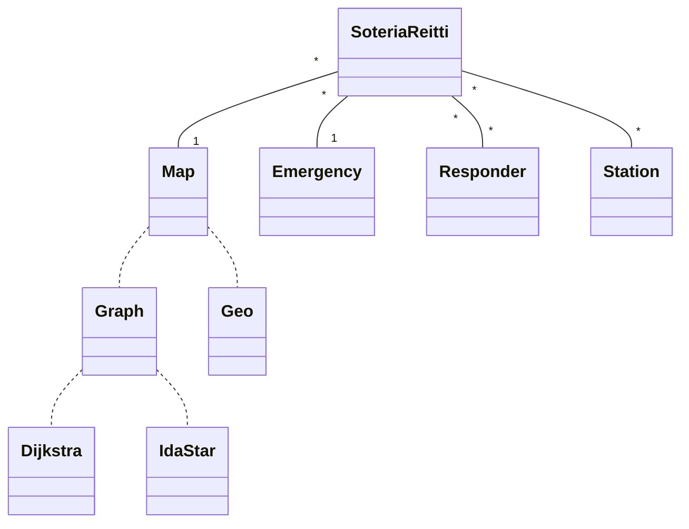

# Toteutusdokumentti 

## Ohjelman Yleisrakenne

SoteriaReitti-sovellus on suunniteltu modulaariseksi ja selkeäksi, mikä mahdollistaa eri komponenttien tehokkaan toiminnan yhdessä. Sovellus koostuu useista pääkomponenteista, kuten Emergency, Responders, Station, Graph ja Geo. Jokainen komponentti vastaa tietystä osa-alueesta.

### Ohjelman rakennetta kuvaava luokka-diagrammi

### Algoritmien käyttö

Sovelluksen nykyisessä toteutuksessa, kun uusi asema (Station) luodaan, sovellus käyttää Dijkstran algoritmia löytääkseen kaikki reitit asemalta jokaiseen kartan pisteeseen. Tämä mahdollistaa erittäin nopean lyhimmän reitin löytämisen suoraan muistista.

Vastausyksiköiden, kuten ambulanssien tai poliisiautojen, lyhimmät reitit hätätapauksiin määritetään IDA*-algoritmilla. Tämä valinta johtuu siitä, että vastausyksiköt voivat liikkua vapaasti kartalla, mikä tekee staattisen muistin käytöstä epäkäytännöllistä. IDA*-algoritmin joustavuus mahdollistaa reittien dynaamisen laskennan ilman tarvetta pitkäaikaiseen muistissa säilyttämiseen. Tällä tavoin sovellus pystyy tarjoamaan tehokkaan ja joustavan reitinhakupalvelun erilaisiin hätätilanteisiin vastaamiseksi.

## Saavutetut Aika- ja Tilavaativuudet

### Dijkstra -analyysi

Dijkstran algoritmin aikavaativuus on $O((V + E) * log(V))$, missä $V$ on solmujen lukumäärä ja $E$ on kaarien lukumäärä verkossa. Algoritmi käyttää minimikekoa solmujen järjestämiseen ja suorittaa päivityksiä jokaiselle solmulle. Aikavaativuus riippuu käytetystä tietorakenteesta ja on yleensä tehokas suurissa verkkoissa, mutta se ei käsittele negatiivisia kaaria ilman erityistoimenpiteitä.

### IDA*-analyysi

IDA\*-algoritmin aikavaativuus riippuu käytetystä heuristiikasta ja verkosta. Algoritmi käyttää syvyyshakua, jossa jokaissella iteroinnilla etsitään reitit, joiden paino on alle tietyn "rajan" (threshold). Aikavaativuus vaihtelee rajan ja käytetyn heuristiikan perusteella. Jos käytetty heuristiikka on admissiivinen (eli ei yliarvioi kustannuksia), IDA* löytää optimaalisen reitin.

Yleisesti ottaen IDA*-algoritmin aikavaativuus on vaikea määrittää tarkasti, koska se riippuu käytetystä heuristiikasta ja verkosta. Mutta suurissa ja monimutkaisissa verkoissa IDA*-algoritmi voi olla hidas, koska se voi joutua tutkimaan suuren määrän tiloja ennen optimaalisen ratkaisun löytämistä. Algoritmin tehokkuus riippuu suuresti heuristiikkafunktion laadusta ja siitä, miten hyvin se arvioi etäisyyksiä lopullisesta tavoitetilasta. Tehokkuuden parantamiseksi IDA*-algoritmin käytössä voisi harkita myös parempia hakuavaruuden rajausstrategioita ja optimointitekniikoita.

### Vertailu

IDA*-algoritmi osoittaa tehokkuutensa erityisesti pienissä verkoissa, missä sen heuristiikkaan perustuva seuraavan solmun valinta tapahtuu tehokkaasti. Pienissä verkoissa IDA*-algoritmi suoriutuu hyvin ja löytää optimaalisen reitin.

Toisaalta suurissa verkoissa Dijkstra-algoritmi on usein nopeampi vaihtoehto tässä projektissa. Dijkstra-algoritmi tarjoaa tehokkaamman suorituskyvyn suurille verkkoalueille.

Vaikka IDA*-algoritmi ei ole aina nopein, se käyttää kuitenkin vähemmän muistia. Tämä piirre on erityisen merkityksellinen responderien kohdalla, jotka voivat liikkua kartassa ja tarvitsevat jatkuvaa reitinhakua. Vähäisempi muistinkäyttö tekee IDA*-algoritmista hyödyllisen vaihtoehdon tilanteissa, joissa muisti on rajallinen.

## Työn Mahdolliset Puutteet ja Parannusehdotukset

Lisäksi käyttöliittymää voisi kehittää tarjoamaan enemmän visuaalista informaatiota käyttäjälle, kuten reittien näyttämisen animoituna kartalla.

## Laajojen kielimallien käyttö.

Projektin suurin osa on saatu päätökseen ilman laajojen kielimallien käyttöä. Kuitenkin olen hyödyntänyt ChatGPT:tä tieteellisten artikkelien selittämiseen, erityisesti IDA*-algoritmin tutkimisessa. Olen kertonut ChatGPT:lle artikkelin sisällön ja pyytänyt tiivistettyä yhteenvetoa siitä.

Lisäksi olen käyttänyt ChatGPT:tä muutaman kerran kirjoitusvirheiden korjaamiseen.

## Lähteet

Sovelluksen kehityksessä on hyödynnetty seuraavia lähteitä:

-   Pythonin virallinen dokumentaatio: [python.org](https://python.org)
-   Tkinterin dokumentaatio: [tkdocs.com](https://tkdocs.com)
-   Customtkiner dokumentaatio: [customtkinter.com](https://customtkinter.tomschimansky.com/)
-   OSM Wiki: [wiki.openstreetmap.org](https://wiki.openstreetmap.org/)
-   Overpy Docs: [readthedocs.io](https://python-overpy.readthedocs.io/en/latest/)

-   IDA* Wikipedia: [wikipedia.com](https://en.wikipedia.org/wiki/Iterative_deepening_A*)
- Real-time vehicle routing and scheduling in dynamic and stochastic traffic networks: [scholar.google.com](https://scholar.google.com/scholar?q=Fu%20L.%20Real-time%20vehicle%20routing%20and%20scheduling%20in%20dynamic%20and%20stochastic%20traffic%20networks.%20Unpublished%20Ph.D.%20Dissertation%2C%20University%20of%20Alberta%2C%20Edmonton%2C%20Alberta%2C%201996)